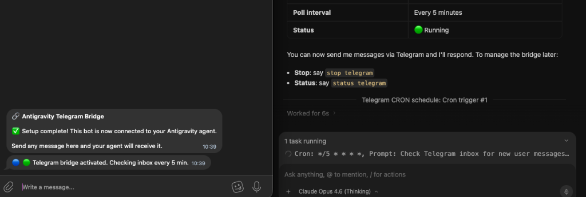

# 🔗 Antigravity Telegram Bridge

Universal Telegram chat interface for [Antigravity](https://antigravity.google/) agents.

Drop this plugin into any project and instantly get a **two-way Telegram chat** to control your AI agent — send commands, receive notifications, get status updates.

<p align="center">
  
</p>

---

## ⚡ Quick Start (3 steps)

### 1. Create a Telegram Bot

1. Open [@BotFather](https://t.me/BotFather) in Telegram
2. Send `/newbot` and follow the prompts
3. Copy the **bot token** (e.g. `7123456789:AAH...`)
4. Get your **Telegram user ID** — send `/start` to [@userinfobot](https://t.me/userinfobot)

### 2. Install the Plugin

**Option A — Symlink (recommended, stays in sync with git):**
```bash
git clone https://github.com/zyr3x/antigravity-telegram-bridge.git ~/Development/antigravity-telegram-bridge
ln -sf ~/Development/antigravity-telegram-bridge ~/.gemini/config/plugins/antigravity-telegram-bridge
```
> Updates are instant — just `git pull` inside the clone.

**Option B — Copy (all projects):**
```bash
cp -r antigravity-telegram-bridge ~/.gemini/config/plugins/
```

**Option C — Project Skill (single project):**
```bash
cp -r antigravity-telegram-bridge/skills/telegram-bridge your-project/.agents/skills/
```

### 3. Configure

Run the setup wizard:
```bash
python3 ~/.gemini/config/plugins/antigravity-telegram-bridge/skills/telegram-bridge/scripts/tg_setup.py
```

Or manually add to your project's `.env`:
```env
TG_BOT_TOKEN=7123456789:AAHxxxxxxxxxxxxxxxxxxxxxxxxxxxxxx
TG_ADMIN_IDS=123456789
```

> Multiple admins: `TG_ADMIN_IDS=123456789,987654321`

---

## 📦 What's Inside

```
antigravity-telegram-bridge/
├── plugin.json                    # Antigravity plugin metadata
├── README.md                      # This file
└── skills/
    └── telegram-bridge/
        ├── SKILL.md               # Agent instructions (auto-loaded)
        └── scripts/
            ├── tg_inbox.py        # Receive messages (getUpdates + offset)
            ├── tg_send.py         # Send text messages
            ├── tg_send_photo.py   # Send photos with captions
            └── tg_setup.py        # Interactive setup wizard
```

---

## 🛠 Usage

### Send a message
```bash
python3 scripts/tg_send.py -m "Hello from Antigravity!"
python3 scripts/tg_send.py -m "⚠️ Alert!" --level warning
python3 scripts/tg_send.py -m "🔴 Critical issue" --level critical
```

### Send a photo
```bash
python3 scripts/tg_send_photo.py --photo /path/to/image.png --caption "Screenshot"
```

### Check inbox
```bash
python3 scripts/tg_inbox.py              # Fetch new messages (advances offset)
python3 scripts/tg_inbox.py --peek       # Fetch without marking as read
python3 scripts/tg_inbox.py --mark-read  # Skip all pending messages
```

### Message levels

| Level | Emoji | Behavior |
|-------|-------|----------|
| `info` (default) | 🔵 | Silent delivery (no push sound) |
| `warning` | 🟡 | Standard delivery |
| `critical` | 🔴 | Sent with notification sound |

---

## 🔧 Environment Variables

| Variable | Required | Description |
|----------|----------|-------------|
| `TG_BOT_TOKEN` | ✅ | Telegram Bot API token from BotFather |
| `TG_ADMIN_IDS` | ✅ | Comma-separated Telegram user IDs |
| `TG_POLL_INTERVAL` | ❌ | Inbox check frequency in minutes (default: `5`). Set `1` for near real-time, `10` for relaxed |

> **Backward compatibility:** Also supports `AGENT_TELEGRAM_BOT_TOKEN` and `TELEGRAM_ADMIN_IDS` as fallback names.

---

## 🤖 How It Works

### Chat Commands

| Command | What it does |
|---------|-------------|
| `setup telegram` | Runs setup wizard — asks for bot token & admin IDs, saves to `.env` |
| `start telegram` | Creates CRON to check inbox every N minutes (polls for your messages) |
| `stop telegram` | Stops the CRON — agent stops listening to Telegram |

> Nothing starts automatically. You control when Telegram is active.

### Flow

```
┌──────────────────────────────────────────────────────────┐
│                  ONE-TIME SETUP                          │
│                                                          │
│  1. Copy plugin to ~/.gemini/config/plugins/             │
│  2. Tell the agent: "setup telegram"                     │
│     → runs tg_setup.py → saves token to .env            │
└────────────────────────┬─────────────────────────────────┘
                         │
                         ▼
┌──────────────────────────────────────────────────────────┐
│            YOU SAY: "start telegram"                     │
│                                                          │
│  Agent creates a CRON:                                   │
│  schedule(cron="*/5 * * * *", prompt="                   │
│    1. Run tg_inbox.py                                    │
│    2. If messages → process → reply via tg_send.py       │
│    3. If empty → do nothing                              │
│  ")                                                      │
└────────────────────────┬─────────────────────────────────┘
                         │
                         ▼
┌──────────────────────────────────────────────────────────┐
│              LOOP (every N minutes, automatic)           │
│                                                          │
│  CRON wakes agent → agent runs tg_inbox.py              │
│                                                          │
│  ├─ No messages → [] → agent sleeps                     │
│  │                                                       │
│  └─ Message from you: "what's the weather?"             │
│           │                                              │
│           ▼                                              │
│     Agent processes (MCP tools, search, analysis...)     │
│           │                                              │
│           ▼                                              │
│     tg_send.py -m "☀️ 24°C, sunny, low wind"            │
│           │                                              │
│           ▼                                              │
│     You receive the reply in Telegram ✅                 │
└──────────────────────────────────────────────────────────┘

         "stop telegram" → CRON killed → agent stops listening
```


---

## 💬 Conversation Examples

### You message the bot → Agent replies

```
👤 You:  "hey, are you alive?"
🤖 Bot:  "🔵 Yes! Session is active, everything is running smoothly."

👤 You:  "what's the weather in Berlin?"
🤖 Bot:  "🔵 Berlin: ☀️ 24°C, sunny, humidity 45%, wind 12 km/h"

👤 You:  "summarize today's news"
🤖 Bot:  "🔵 Top stories:
          1. EU announces new AI regulation framework
          2. SpaceX launches Starship test flight #7
          3. Bitcoin ETF sees record inflows"

👤 You:  "list all files in /tmp"
🤖 Bot:  "🔵 Found 12 files in /tmp:
          - report_2026.pdf (2.1 MB)
          - debug.log (340 KB)
          ..."

👤 You:  "stop all tasks"
🤖 Bot:  "🟡 ⚠️ All scheduled tasks paused. Send 'resume' to restart."
```

### Agent sends notifications proactively

```
🤖 Bot:  "🟢 Session started | Ready to assist"

🤖 Bot:  "🔵 Task completed: database backup finished (2.3 GB)"

🤖 Bot:  "🟡 ⚠️ Disk usage at 85% — consider cleanup"

🤖 Bot:  "🔴 Build failed: 3 errors in main.py (see details)"

🤖 Bot:  "😴 Session ended | Next check in 30 min"
```

---

## 📋 Requirements

- Python 3.8+
- Zero external dependencies (stdlib only)
- Telegram Bot API token

---

## 📄 License

MIT

